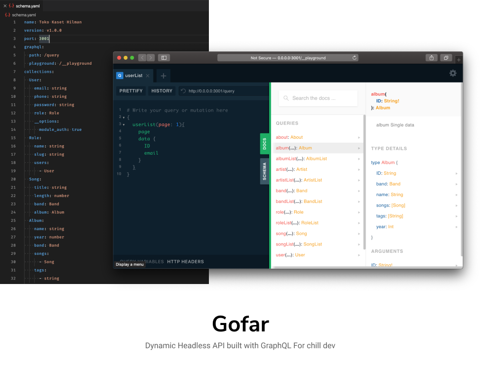

# Gofar

## Motivasi

Tujuan yang dicapai adalah membuat Interface API yang dinamis dan ramah untuk developer dan beberapa driver database seperti MongoDB, Mysql, etc..

## Contoh penggunaan

Kita definisikan dulu model database dan konfigurasi lain nya di file `schema.yaml`

Seperti contoh berikut

```yaml
name: Toko Kaset Hilman
version: v1.0.0
port: 3001
graphql:
  path: /query
  playground: /__playground
database:
  driver: mongoDB
  host: localhost
  username: admin
  password: admin
  database: toko-kaset
models:
  User:
    email: string
    phone: string
    password: string
    role: Role
    __options:
      module_auth: true
  Role:
    name: string
    slug: string
    users:
      - User
  Song:
    title: string
    length: number
    band: Band
    album: Album
  Album:
    name: string
    year: number
    band: Band
    songs:
      - Song
    tags:
      - string
  Artist:
    name: string
    Band: Band
  Band:
    name: string
    artists:
      - Artist
    albums:
      - Album
```

Dengan melakukan perintah

```bash
go run github.com/pedox/gofar/server
```

~~secara otomatis Schema akan terbentuk di database **(BELUM DI IMPLEMENTASI)**~~

Dan GraphQL Playground dapat diakses di http://localhost:3001/__playground

## EARLY STAGE

Sebenernya ini baru cuma berupa _Proof of Concept_ dimana kedepan nya akan ada beberapa fitur dan module yang perlu dikembangkan diantara nya.

- [ ] Middleware Authentication
- [ ] Middleware Roles
- [ ] Basic CRUD
- [ ] ACL
- [ ] Role based Model
- [ ] Seamless Database Migration
- [ ] Hook

## Beberapa modul go yang digunakan

- github.com/labstack/echo
- github.com/iancoleman/strcase
- github.com/graphql-go/graphql
- github.com/99designs/gqlgen
- gopkg.in/yaml.v2
